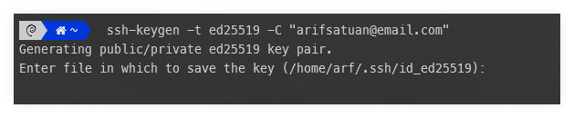
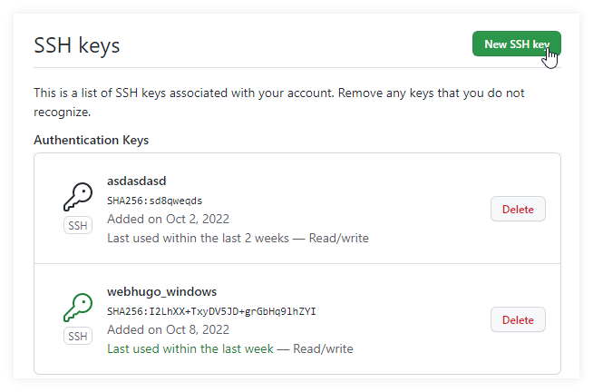
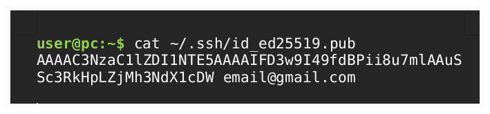
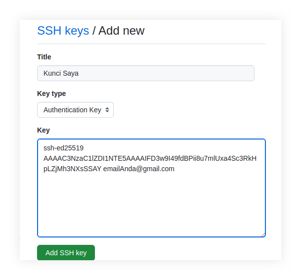
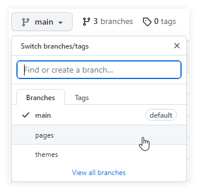
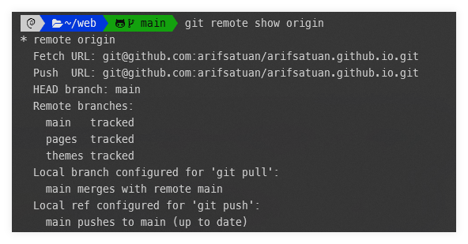

# Catatan GitHub

## 1. Koneksi dengan SSH 
Penggunaan github menggunakan akun (https) sudah tidak didukung saat ini. Oleh karena itu pengguna beralih menggunakan SSH. Langkah lengkap bisa dicek [di sini](https://docs.github.com/en/authentication/connecting-to-github-with-ssh/generating-a-new-ssh-key-and-adding-it-to-the-ssh-agent)
### 1.1 Membuat key SSH 
```bash
$ ssh-keygen -t ed25519 -C "your_email@example.com"
```
### 1.2 Simpan SSH Key
Jika ada keterangan seperti berikut, tekan enter saja berulang


Isikan password jika ditawarkan seperti berikut
```bash
> Enter passphrase (empty for no passphrase): [Type a passphrase]
> Enter same passphrase again: [Type passphrase again]
```
### 1.3 Run SSH-Agent
Jalankan SSH-Agent dan tambahkan key ke SSH
```bash
$ eval "$(ssh-agent -s)"
> Agent pid 5956xx 
$ ssh-add ~/.ssh/id_ed25519
```
### 1.4 Setting Github
Login dan tambahkan key SSH ke github ke [https://github.com/settings/keys](https://github.com/settings/keys). Lalu Klik `New SSH Key`


Dapatkan key SSH dari poin 2 dan 3 di atas dengan 
```bash
cat ~/.ssh/id_ed25519.pub 
```


Copy paste ke kolom berikut, Klik Add SSH Key 


## 2. Clone GIT dari repository
Cara clone git tergantung jenis repositorynya. Jika memiliki beberapa branch pastikan setiap branch juga diclone
### 2.1 Clone Repo Ke Folder
Misal akan clone repo ke folder web
```bash
git clone git@github.com:<username>/<namarepo>  <nama folder>
git clone git@github.com:arifsatuan/arifsatuan.github.io.git web
```
### 2.2 Clone semua Branch
Apabila code terpisah dari beberapa branch, clone juga branch lainnya. Perhatikan gambar berikut

Bisa juga perintahkan pada folder `web` tadi, untuk menunjukkan branch apa saja yang tersedia

Berikut cara clone branch `paper` ke folder `public`
```bash
 git clone -b pages git@github.com:arifsatuan/arifsatuan.github.io.git public
 git clone -b themes git@github.com:arifsatuan/arifsatuan.github.io.git themes/LoveIt
```


