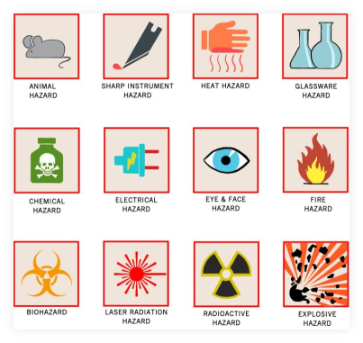

### 1. Hakikat Fisika
   Sains adalah ilmu pengetahuan yang mempelajari gejala alam melalui pengamatan, eksperimen, dan analisis. Sains pada hakikatnya merupakan sebuah kumpulan pengetahuan (“_a body of knowledge_”), cara atau jalan berpikir (“_a way of thinking_”), dan cara untuk penyelidikan (“_a way of investigating_”)”. Istilah lain yang juga digunakan untuk menyatakan hakekat IPA adalah IPA sebagai produk untuk pengganti pernyataan IPA sebagai sebuah kumpulan pengetahuan (“a body of knowledge”), IPA sebagai sikap untuk pengganti pernns, maka ketiga hakikat tersebut juga melekat di dalamnya.

#### 1.a Fisika sebagai produk 
  Produk yang dimaksud dalam fisika adalah kumpulan pengetahuan yang dapat berupa fakta, konsep, prinsip, hukum, rumus, teori dan model. 

Fenomena lampu yang sedang menyala merupakan produk fiiska berupa fakta. Bagaimana lampu bisa menyala memerlukan penjelasan konsep listrik, hukum ohm dan beberapa hal lain. Agar lebih memahami produk dalam pembelajaran fisika dapat dilihat berikut ini

**Fakta** 
Fakta ilmiah di fisika adalah deskripsi terhadap apa yang teramati, atau pernyataan objektif yang dapat dikonfirmasi kebenarannya mengenai sesuatu yang benar-benar ada atau terjadi. 
Contoh 
1. Lampu dialiri arus listrik menyala
2. Api terasa panas
3. Magnet menarik benda tertentu

**Konsep** 
Konsep adalah rumusan atau gagasan umum tentang objek atau kejadian yang didasarkan pada sifat objek tersebut. Konsep biasanya mirip dengan `definisi` 
Contoh 
1. Jarak adalah panjang lintasan yang dilewati benda
2. Gravitasi adalah gaya tarikan menuju pusat (bumi).
3. Gaya adalah sesuatu mengenai tarikan atau dorongan dan memiliki nnilai dan arah. 

**Prinsip** 
Prinsip adalah perumusan antara fakta dan konsep. Prinsip sifatnya melihat hubungan, bukan sekedar diamati.  
Contoh 
1. Prinsip Archimedes: _"gaya apung ke atas yang diberikan pada benda yang direndam dalam cairan (keseluruhan atau sebagian), sama dengan berat cairan yang dipindahkan benda tersebut"_
2. Prinsip pemuaian : _"benda yang dipanaskan akan memuai"_. Prinsip ini menghubungkan zat, panas dan pemuaian
3. Prinsip aliran air : _"air selalu mengalir dari tempat yang tinggi ke tempat yang rendah_". Ada konsep air mengalir, serta energi potensial

**Hukum** 
Hukum adalah prinsip-prinsip khusus yang diterima secara meluas setelah melalui pengujian berulang. Perhatikan bahwa hukum harus **diuji** terlebih dahulu  
Contoh: 
1. Hukum kekekalan energi : Energi tak dapat diciptakan atau dimusnahkan melainkan hanya dapat diubah bentuk 
2. Benda yang dicelupkan ke dalam air akan merasakan gaya apung yang besarnya sama dengan berat air yang dipindahkan. Prinsip Archimedes merupakan hukum dalam fisika. 
3. Hukum Avogadro : volume yang sama pada gas di kondisi suhu dan tekanan yang sama akan mengandung jumlah molekul yang sama
4. Hukum Ohm : Arua yang melalui penghantar antara dua titik, proporsional terhadap beda potensial.   Lebih lengkapnya [klik di sini](https://www.jagranjosh.com/general-knowledge/important-laws-of-physics-1513943551-1)

**Teori** 
Teori ilmiah adalah penjelasan umum atau model imaginatif tentang hubungan fakta, konsep, dan ilmiah . Kadang teori belum terbukti namun belum bisa dibantah karena berupa perkiraan.  
1. Teori Big bang : Alam semesta, galaksi dan bintang serta tatasurya terbentuk melalui peristiwa dentuman besar
2. Teori relativitas khusus Einstein mengenai ruang dan waktu pada kecepatan relatif mendekati kecepatan cahaya

**Rumus** 
Rumus adalah pernyataan matematis dari fakta, konsep, prinsip, hukum maupun teori. Ini yang sering dilihat sebagai Fisika, bahkan beberapa merasa ketakutan saat melihat rumus yang makin rumit. Padahal rumus atau persamaan digunakan untuk mempermudah dalam melihat keterkaitan antar konsep-konsep dan variabel di dalamnya. Semoga peserta didik SMA 81 termasuk siswa yang melihat rumus sebagai alt yang mempermudah :palms_up_together:. Contoh persamaan $$F = m.a$$ 
Terdapat 3 variabel yang bisa salah satunya berubah, namun harus mengikuti persamaan. Tidak mungkin $F=3$ N, sedangkan $m=5$ kg dan $a=5$ m/s2. Ini sudah menyalahi persamaan di atas. Begitu pula saat $F = 10, m=5, a=2$, agar $a$ menjadi $4$ dengan $m$ tetap, maka perlu $F$ dua kali lipat.
$$ 10 = 5\times 2$$
$$ F = 5 \times 4$$

**Model** 
Model adalah sebuah alat bantu yang merepresentasikan sesuatu yang tidak dapat dilihat atau divisualisasikan. Model sangat bermanfaat untuk mempelajari hal yang abstrak seperti bentuk atom.

#### 1.b Fisika sebagai proses 
Fisika sebagai proses ilimiah berkaitan dengan cara kerja para ilmuwan untuk memperoleh pengetahuan-pengetahuan yang menyusun fisika. Dalam hal ini pengetahuan diperoleh melalui cara penyelidikan (_a way of investigating_) terhadap suatu fenomenda. Adapun selampu penyelidikan ada proses sains meliputi:
1. Mengamati (observasi), yaitu melakukan kegiatan yang melibatkan panca indera terhadap fenomena alam yang diselidikit
2. Melakukan klasifikasi, kategorisasi atau seriasi
3. Melakukan pengukuran menggunakan alat ukur yang sesuai
4. Mengajukan pertanyaan
5. Merumuskan hipotesis
6. Merencanakan penyelidikan/percobaan 
7. Meninterprestasi/menafsirkan in.
8. Mengkomunikasikan, yaitu menyampaikan hasil percobaan atau penyelidikan melalui cara atau media tertentu. Misal megnggunkan jurnal dan sebagainya. 

Menurut Franz dalam Collette & Chiappetta (1994:36) aspek yang dapat dikembangkan dalam _way of investigating_ adalah (1) _observing_ (2) _collecting data_(3) _developing a hypothesis_ (4) _experimenting_ (5) _concluding_ 

#### 1.c Fisika sebagi sikap
Setiap langkah dalam proses membutuhkan sikap ilmiah yang baik, antara lain rasa ingin tahu, rasa percaya, kreatif, teliti, objektif, jujur, terbuka, mau bekerja sama, dan mau mendengarkan pendapat orang lain.

### 2. Metode Ilmiah
Metode ilmiah adalah prosedur dalam mendapatkan pengetahuan yang disebut ilmu. Jadi, ilmu adalah pengetahuan yang didapatkan lewat metode ilmiah. Syarat-syarat yang harus dipenuhi suatu pengetahuan dapat disebut ilmu dan dikatakan
ilmiah adalah sebagai berikut:
1. **Objektif**, artinya harus sesuai dengan kenyataan didukung fakta [empiris](https://kbbi.kemdikbud.go.id/entri/empiris)
2. **Metodik**, menggunakan metode tertentu yang teratur dan terkontrol
3. **Sistematik**, pengetahuan itu disusun dalam sistem yang saling berkaitans sama lain sehingga menjadi kesatuan yang utuh
4. **Berlaku umum**, artinya tidak hanya diamati seseorang, harus bersifat universal.

#### Langkah metode Ilmiah 
1. Observasi. Langkah awal adalah melakukan pengamatan atau observasi melalui pengamatan yang kulitatif mauput kuantitatif
2. Merumuskan masaalah. Pertanyaan 5W+1H mengenai objek yang diteliti. Sehingga jelas batas yang akan diamati. 
3. Mengumpulkan data. Pengumpulan data dapat dilakukan dari literatur, buku atau informasi dari internet. 
4. Membuat Hipotesis. Hipotesis adalah jawaban sementara atau dugaan sementara mengenai masalah yang akan diselidiki. Hipotesis harus berdasarkan pengamatan, pengalaman, atau informasi awal. Contoh : _semakin lama pemanasan zat [vibranium](https://marvel.fandom.com/wiki/Vibranium), maka akan semakin tinggi kenaikan suhu_. Itu adalah hipotesis, bisa jadi nanti ditemukan bahwa zat vibranium tidak bisa panas. 
5. Melakukan eksperiman. Dalam mendesain eksperimen harus menyertakan tiga jenis variabel.
   - variabel bebas
   - variabel terikat
   - variabel kontrol
6. Analisis Data. Data dikelola dan disajikan dalam tabel, grafik, matriks, sehingga diperoleh data yang bisa diamati
7. Menarik kesimpulan. Kesimpulan merupakan penialian apakah dalam sebuah hipotesis yang akan diajukan dapat diterima atau ditolak. Apabila dalam proses pengujian terdapat fakta yang cukup mendukung, maka hipotesis itu diterima. Sebaliknya hipotesis bisa ditolak.  

### 3. Keselamatan Kerja 
Dalam melakukan penelitian atau praktikum Fisika, kita terkadang diharuskan
bekerja di laboratorium. Laboratorium merupakan ruangan yang memiliki risiko yang cukup besar. Keselamatan semua pihak merupakan tanggung jawab semua pengguna
laboratorium. Namun, banyak pekerja yang meremehkan risiko kerja, sehingga tidak menggunakan alat-alat pengaman walaupun sudah tersedia Dilaboratorium banyak
terdapat bahan kimia yang merupakan bahan mudah meledak, mudah terbakar, beracun, dll. Selain itu terdapat juga benda mudah pecah dan menggunakan listrik. Salah satu penanda adalah fokus pada rambu-rambu di laboratorium seperti berikut

### 4. Tugas Mandiri 

<link rel="stylesheet" href="/css/form.css">

<iframe name="hidden_iframe" id="hidden_iframe" style="display:none;" 
onload="if(submitted) {window.location='/thankyou';}"></iframe>

<form action="https://docs.google.com/forms/d/e/1FAIpQLSd43IjAIBJEYvhWlAWXCEZ67APgEVAubD3bZxanJudhxbKOQw/formResponse" 
method="post" target="hidden_iframe" onsubmit="submitted=true;">
</form>
<form action="https://docs.google.com/forms/d/e/1FAIpQLSd43IjAIBJEYvhWlAWXCEZ67APgEVAubD3bZxanJudhxbKOQw/formResponse" method="post" target="hidden_iframe" onsubmit="submitted=true">
  <label>NIS</label>
        <input type="text" pattern="^[0-9]{5}$" placeholder="5 digit NIS" class="form-input" name="entry.154653614" required title="Harus 5 digit atuh Neng!">

   <label>Pertanyaan 1</label>
        <textarea rows="8" placeholder="Rangkum apa saja yang sudah dibaca di bacaan di atas dalam 3 paragraf" class="form-input" name="entry.1125416052" ></textarea>
 <label>Pertanyaan 2</label>
        <textarea rows="8" placeholder="Sebutkan satu rumus, apa saja variabelnya, konsep apa yang ada di dalamnya" class="form-input" name="entry.394474086" ></textarea>

   <button type="submit">Send</button>
</form>




<iframe style="height:400px; width:100%" src="https://docs.google.com/spreadsheets/d/e/2PACX-1vTx7GJTfNij7kKAurUSBKxLFaCAGNFkYeA2IO7qnXyPL4Ep-6EcYp_VY7JXS_p5P8MMVzZKLzjvgut_/pubhtml?gid=1904460953&amp;single=true&amp;widget=true&amp;headers=false"></iframe>

