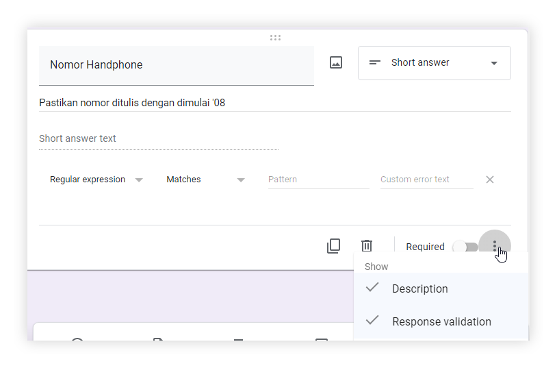
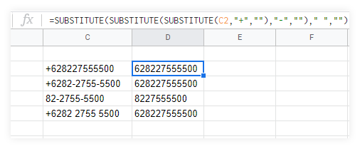
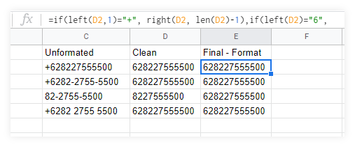

Format nomor handphone sering kali menyulitkan karena banyak sekali format. Mulai dari perbedaan tanda `+62` maupun tanda `-` sebagai separator. Perlu pengolahan data yang efisien. Sampai saat ini, saya sendiri belum menemukan cara yang efektif. Berikut adalah tahapan yang biasa dilakukanL
### 1. Memastikan inputannya google form seragam
Google Forms memiliki fitur `regex` dalam validasi inputan. Manfaatkan fitur ini secara maksimal dengan menambahkan `regular expression ‣ matches`. 

Pada contoh pengisi form akan dipaksa mengisi nomor handphone dengan dimulai `'08` , pada bagian pattern diisi
```
^\'0[0-9]{9,13}$
```
Arti regex di atas kurang lebih dimulai dengan `'0` dan dilanjutkan 9 digit sampai 13 digit lainya. 
Dengan begini hasil akan dipastikan sesuai format `'0812345000`


Ada banyak format regex yang disediakan. Sebelum diimplementasikan silakan coba simulasikan di [regex101.com](https://regex101.com/). Adapun contoh regex google forms lain bisa dicek di website [labnol.org](https://www.labnol.org/internet/regular-expressions-forms/28380/)


### 2. Membersihkan Data
Jika sudah terlanjur data tercampur (tidak menggunakan regex pada form), maka gunakan rumus pada spreadsheet. 
```
=SUBSTITUTE(SUBSTITUTE(SUBSTITUTE(C2,"+",""),"-","")," ","")
```


### 3. Menyeragamkan Data
Di indonesia format nomor dimulai dari 08xxx atau 628xxx jika ditulis beserta prefix kode negara. 
Agar semua nomor bisa diseragamkan, bisa diubah dengan rumus 
```
=if(left(D2,1)="+", right(D2, len(D2)-1),if(left(D2)="6", D2,if(left(D2)="0", right(D2, len(D2)-1),if(left(D2)="8", "62"&D2,""))))
```


### 4. Penutup
Semoga kedepannya setiap admin yang membuat forms memikirkan penulisan format nomor ini agar menjadi lebih mudah pengolahan selanjutnya. 


Misal pada kolom `F2` akan dilanjutkan dengan hyperlink whatsapp to chat, bisa ditambahkan formula
```
=hyperlink("https://wa.me/"&E2,"Klik to Chat")
```

