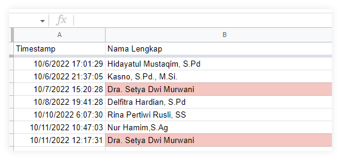
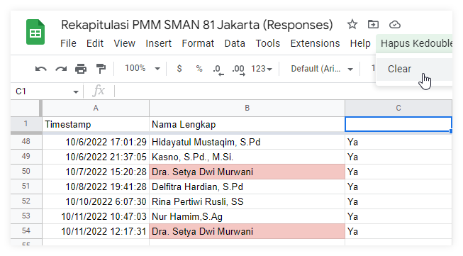
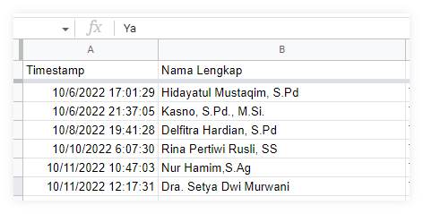
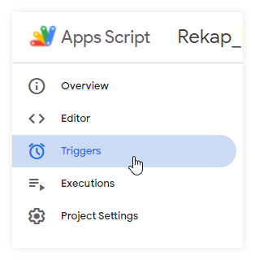
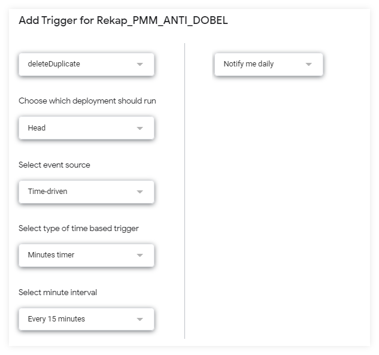

Penggunaan Google Forms memudahkan kita dalam mengumpulkan data dengan cepat. Ada kalanya input data perlu diperbaiki. Saya pribadi sering berkomentar `"Silakan input lagi, nanti yang awal saya hapus"`. Pada praktiknya berat sekali untuk mengecek input yang terduplikasi, apalagi harus menghapus secara manual. Oleh karena itu iseng membuat script otomatis untuk melakukan hal tersebut. 
### 1. Membuat spreadsheets
Langkah awal, buat script di google spreadsheets, bisa dilihat [di sini](https://arifsatuan.github.io/script_gdrive/). Berikut script untuk membaca dan menghapus inputan yang terduplikasi 

```js
function onOpen() {
  var SS = SpreadsheetApp.getActiveSpreadsheet();
  var ui = SpreadsheetApp.getUi();
  ui.createMenu("Hapus Kedouble")
    .addItem("Clear", "deleteDuplicate")
    .addToUi();
};
function deleteDuplicate() {
// Isikan getSheetByName dengan nama sheet Response
var sh = SpreadsheetApp.getActiveSpreadsheet().getSheetByName("Responses");

  // kolom A x[0], kolom B x[1] dsb, disimpan di value
  var val = sh.getDataRange().getValues().map(x => x[1]);

  // get indexes of duplicated values in the column
  var duplicates = val.map((x,i) => 
    val.slice(i+1).includes(x) ? i+1 : '').filter(String); 
     // remove rows by the indexes
  duplicates.reverse().forEach(x => { sh.deleteRow(x); SpreadsheetApp.flush() });
}
```
Menjalankan program bisa diakses di menu custom seperti berikut


Setelah dijalankan maka daftar akan bersih dari data yang terduplicate


### 2. Membuat trigger
Jika menjalankan program harus membuka file tentu saja cukup merepotkan. Untuk mengatasi, gunakan triger dengan mengakses fitur di apps script.


Kemudian klik ` + Add Trigger ` dan atur seperti gambar berikut.


### 3. Penutup
Demikian cara membuat script otomatis agar menghapus inputan (response google form) yang terduplikasi. Semoga membantu :heart:
