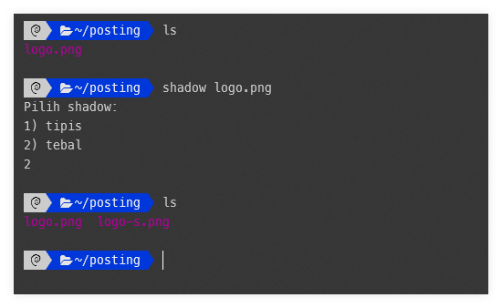

Membuat screenshoot dengan shadow di sekitarnya dapat dilakukan dengan aplikasi editing seperti photoshop. Terlalu repot jika melakukannya berulang. Padahal bisa dilakukan dengan script `bash` sederhana
### 1. Install imagemagick
Buka terminal dan install dengan 
```bash
sudo apt install imagemagick
```

### 2. Membuat script
Buat script sederhana di lokasi `/usr/share/bin`
Ganti `vim` dengan `nano` atau editor favorit
```bash
sudo vim /usr/share/bin/shadow
```
Lalu isikan script berikut
```bash
#!/bin/bash
echo "Pilih shadow:"
echo "1) tipis"
echo "2) tebal"
read pil
if [[ $pil -eq 2 ]]
then
        convert $1 \( +clone -background black -shadow 10x10+0+0 \) +swap -bordercolor none -border 20 -background none -layers merge +repage ${1%.png}-s.png
elif [[ $pil -eq 1 ]]
then
        convert $1 \( +clone -background black -shadow 5x5+0+0 \) +swap -bordercolor none -border 5 -background none -layers merge +repage ${1%.png}-s.png
fi
```
Pastikan script tersebut bisa dijalankan
```bash
sudo chmod +x /usr/share/bin/shadow
```

### 3. Ujicoba 
Langkah selanjutnya adalah menguji dengan file `png` yang support transparansi. Perhatikan sample berikut

Hasilnya bisa dilihat pada gambar berikut 
asli (kanan)shadow")

### 4. Penutup
Silakan bereksperimen dengan penamaan atau ketebalan shadow. Perhatikan `-shadow 10x10+0+0` bisa diganti dengan angka lain. Begitu pula dengan `border` bisa disesuaikan. 
Script sederhana bisa mengurangi pekerjaan sekaligus menambah estetika jika dipasang pada website dengan template polos. 
:heart:
