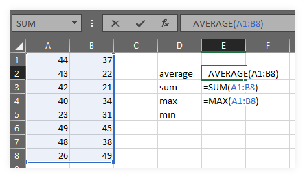
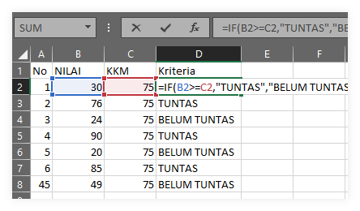
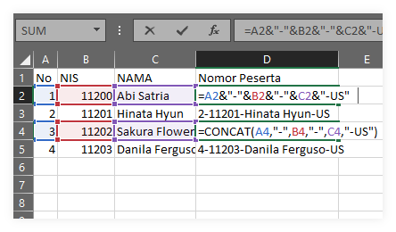
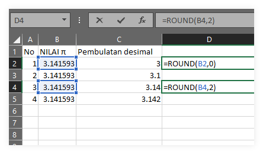

Banyak sekali fitur dan formula atau rumus pada Microsoft Excel, namun dalam tulisan kali ini akan dipilih rumus yang paling sering digunakan. Sebagai informasi bahwa sebagian besar rumus ini berlaku juga di Google Spreadsheets

### 1. sum, average, max, min 
Rumus ini merupakan rumus paling dasar dalam pengelolaan data menggunakan Microsoft Excel - Spreadsheets
```scala
=SUM(CELLYANGDIJUMLAH)  , contoh =SUM(A1:B8)
=AVERAGE(rentang rata-rata) , contoh =AVERAGE(A1:B8)
=MAX(rentang dicari maksimal), contoh =MAX(A1:B8)
=MIN(rentang dicari minimal), contoh =MIN(A1:B8)
```


### 2. IF (Conditional)
Rumus kedua yang penting adalah IF. 
```scala
=IF(logika yang diuji, hasil jika benar, hasil jika salah)
=IF(B2>=C2,"TUNTAS","BELUM TUNTAS")
```

Pada tampilan di atas, ada yang disebut operator logika ` >=` yang artinya lebih besar atau sama dengan. Sehingga bernilai benar apabila B2 nilainya lebih besar atu sama dengan C2. Berikut adalah tabel operator logika yang bisa digunakan

| No | Operator | Arti                          |
|----|----------|-------------------------------|
| 1  | ` = `    | sama dengan                   |
| 2  | ` > `    | lebih besar dari              |
| 3  | ` < `    | kurang dari                   |
| 4  | ` >= `   | lebih besar atau sama dengan  |
| 5  | ` <= `   | kurang dari atau sama dengan  |
| 6  | ` <> `   | tidak sama dengan             |

Lebih lanjut lagi adalah `nested IF` dengan skema
```scala
=IF("syrt1","hasil1", IF("syrt2","hasil2","salah"))
cat: "hasil jika salah digantikan IF kedua"
```

### 3. concat
Penggunaan `CONCAT` ada dua jenis, yakni dengan formula atau dengan tanda `&` untuk menggabungkan teks. 
> teks atau string ditandai dengan tanda kutip `"10A1" & "-" &CELL`
> hasilnya `10A1-ArifSatuan`
 
```scala
=CONCAT(cell yang digabung)
=A2&"-"&B2&"-"&C2&"-"&US"
```

Perhatikan gambar di atas, bahwa rumus `&` dan `CONCAT` menghasilkan output yang sama. Silakan dipilih sesuai dengan selera.

### 4. round
Formula selanjutnya yang sering digunakan adalah `ROUND` yang berfungsi untuk membulatkan desimal. Biasa digunakan pada hasil akhir pelaporan, misalnya nilai rapor sekolah. 
```scala
=ROUND(angka, desimal)
=ROUND(A2, 0)
=ROUND(A2, 1)
=ROUND(A2, 3)
```
 
