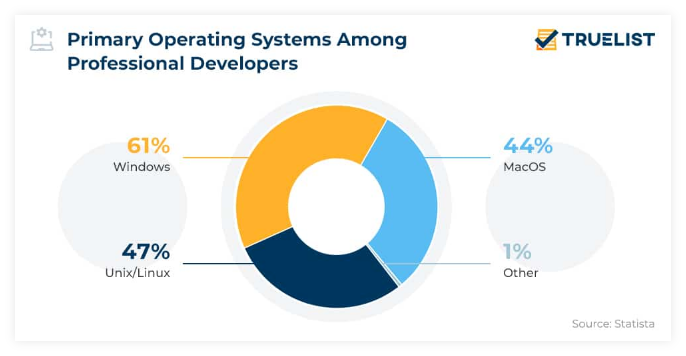
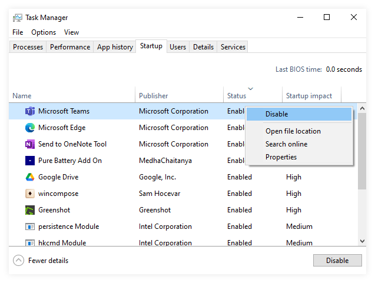
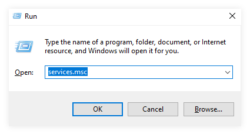
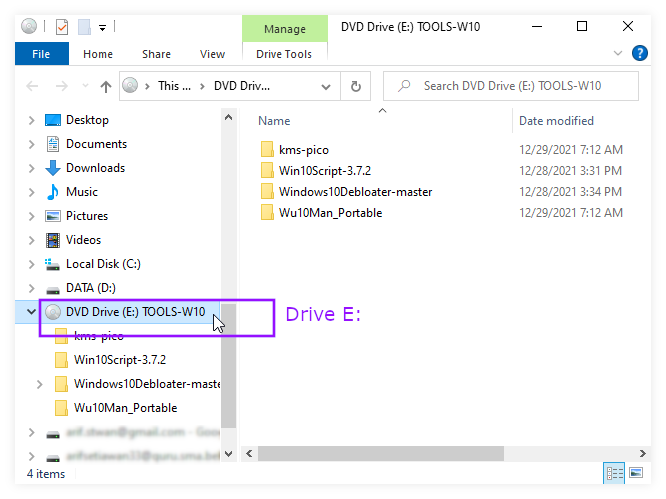
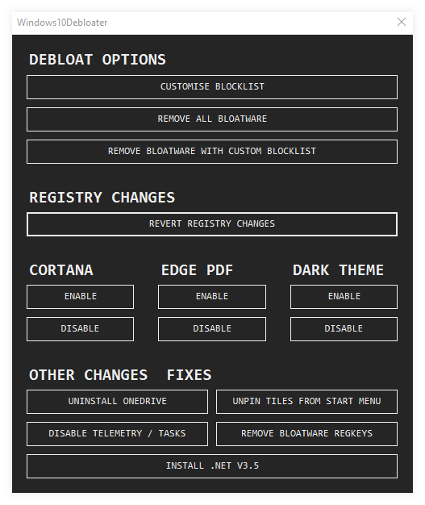
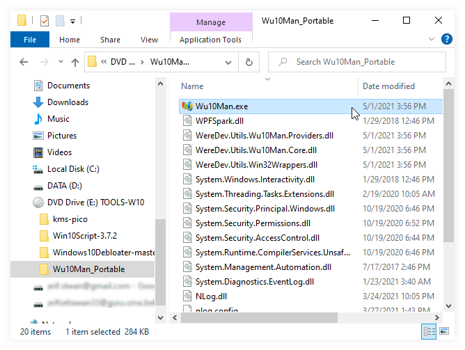
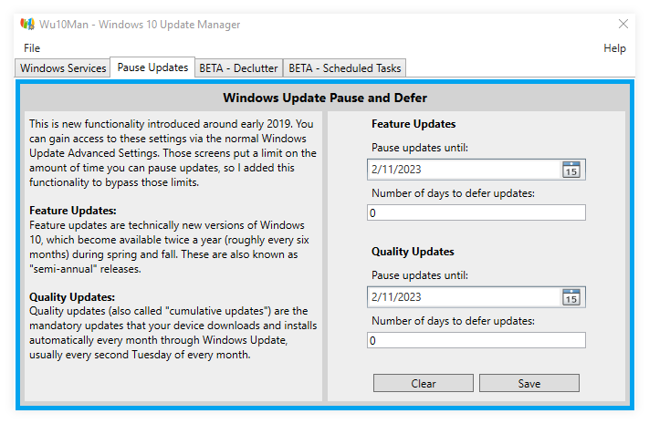
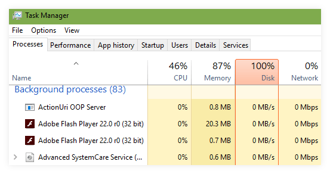
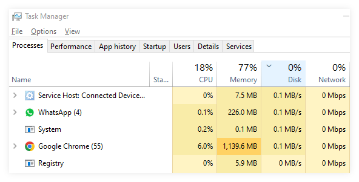
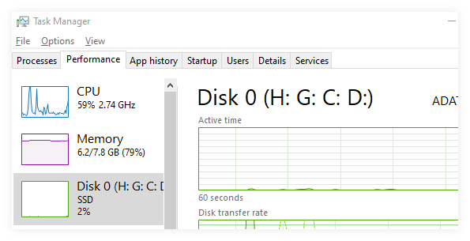

Windows masih menjadi OS (operating sistem) paling banyak digunakan berdasarkan grafik di tahun 2022 berikut


Bagi pemilik komputer atau laptop dengan kategori `high-end` tentu saja windows 10 cukup nyaman untuk digunakan sehari-hari. Lain halnya dengan perangkat yang memiliki processor hemat (daya maupun harga), maupun perangkat yang sudah lama. Keluhan seperti lemot, cepat panas, dan lain-lain tentu saja membuat tidak nyaman. Berikut tips optimasi windows yang bisa dilakukan 

### 1. Kurangi Aplikasi Startup
Aplikasi yang menyala di awal sangat berefek pada "lemot" laptop atau PC. Cara kita mengetahui dapat menggunakan task manager. Mengakses task manager ada beberapa cara 
| Cara    | Keterangan |
|---------|------------|
|shortcut | <kbd>Ctl</kbd>+<kbd>Alt</kbd>+<kbd>Dell</kbd> pilih task manager |
|win +R   | <kbd>:(fa-brands fa-windows):</kbd>+<kbd>R</kbd> ketik `taskmgr` |
|taskbar  | Klik kanan pada taskbar , pilih task manager (tidak berlaku W11)|

Setelah terbuka,  pilih tab `startup`→`status`. Pilih aplikasi yang tidak diperlukan menyala sejak awal `klik kanan`→`disable`. 

>Aplikasi yang tidak diperlukan antara lain `OneDrive`,`Ms Edge`,`Ms Teams`, `Cortana`, `AcroTray`). Aplikasi lainnya bisa dilakukan percobaan sendiri.

### 2. Disable Services
Selain aplikasi yang menyala di awal, service atau program di belakang layar juga mempengaruhi kinerja laptop atau PC. 
| Cara    | Keterangan |
|---------|------------|
|win +R   | <kbd>:(fa-brands fa-windows):</kbd>+<kbd>R</kbd> ketik `services.msg`  Klik `OK`|


Kemudian pilih service yang tidak diperlukan untuk dihentikan 

Caranya :  `klik kanan` -> `Properties` -> `startup type : disabled` -> `stop`
 
<video width=100% controls autoplay>
    <source src="video.mp4" type="video/mp4">
    Your browser does not support the video tag.  
</video>


Berikut adalah daftar service yang aman untuk di _disable_ 
| No | Service                                 | Fungsi                                                                                             |
|----|-----------------------------------------|----------------------------------------------------------------------------------------------------|
| 1  | Diagnostic Policy Service               | Diagnosa secara otomatis suatu error atau kesalahan yang sedang terjadi pada suatu komputer/laptop |
| 2  | IP Helper                               | Helper pada IPv6. Biasanya tidak digunakan                                                         |
| 3  | Office Software Protection              | Software proteksi dari Ms. Office                                                                  |
| 4  | Offline Files                           | Cache file                                                                                         |
| 5  | Plug and Play                           | Menjalankan otomatis file di Flashdisk/CD                                                          |
| 6  | Performance Logs & Alerts               | Mencatat performa dan Alert Events                                                                 |
| 7  | Print Spooler                           | Jika PC/laptop tidak digunakan utk print, disable saja                                             |
| 8  | Program Compatibility Assistant Service | Compability mode. Hampir tidak pernah digunakan                                                    |
| 9  | Remote Desktop Service                  | Sering pakai teamviewer? Remote desktop? Jika tidak, bisa _disable_                                |
| 10 | Remote Registry                         | Sama dengan nomor 9                                                                                |
| 11 | Secondary Logon                         | Jika membutuhkan login pakai user kedua                                                            |
| 12 | Smart Card                              | Smart Card? Pernah dengar? Berarti tidak pernah dipakai. _Disable_ saja                            |
| 13 | System Event Notification Services      | Services ini berfungsi untuk memberikan pemberitahuan mengenai jaringan dan maintenence            |
| 14 | Task Scheduler                          | Perintah terjadwal, seperti update dll. Agak penting sih, tapi silakan saja.                       |
| 15 | Windows Event Log                       | Pencatat kejadian, error dsb.                                                                      |
| 16 | Windows Search                          | Cari file jadi lebih cepat (pada laptop canggih). Kalau laptop lemot, mending disable              |
| 17 | Windows Update                          | Kadang tetap berjalan sendiri walaupun sudah _disable_                                             |


### 3. Disable telemetry
Disable telemetry sepertinya cukup rumit, oleh karena itu bisa dengan menjalankan script dengan [download di sini](https://sman81jkt.sch.id/wp-content/uploads/TOOLS-W10.iso)
Setelah didownload, buka dengan klik 2 kali sehingga muncul

Catat nama drivenya `E:` untuk perintah berikutnya. Kemudian buka `powershell` dengan cara klik tombol:

<kbd>:(fa-brands fa-windows):</kbd>+<kbd>X</kbd> Lalu klik `Powershell (Admin)`
 Pilihan Win+X   |  (kanan) tampilan Powershell")
Copy **per baris** perintah berikut, lalu klik enter setiap barisnya
```ps1
cd E:   
PowerShell.exe -ExecutionPolicy Bypass -File .\Windows10Debloater-master\Windows10DebloaterGUI.ps1 
```
Setelah muncul tampilan windows debloater pilih `disable telemetry` , `disable cortana`, `uninstall OneDrive` (jika tidak pernah dipakai)


Langkah terakhir adalah `restart`

### 4. Pause windows update
Windows update juga merupakan salah satu fitur yang memberatkan pada perangkat dengan spesifikasi rendah. Buka folder `TOOLS-W10` serperti [ini](#3-disable-telemetry). Buka folder `WuMan10_Portable` lalu jalankan file `Wu10man.exe`

Pilih tab `Pause update` lalu pilih tanggal yang jauh (2024 atau 2025) → `save`

 
### 5. Ganti HDD ke SSD
Salah satu faktor paling berpengaruh adalah kecepatan baca tulis data pada hardisk (media penyimpanan). Hardisk yang lambat akan nampak selalu `100%` dalam statusnya.  Untuk mengatasi hal tersebut tidak banyak upaya yang bisa dilakukan selain mengganti hardware ke SSD (Solid State Drive) atau Hardisk yang tidak ada piringannya /bagian berputar. Langkah pengecekannya cukup mudah, nyalakan komputer atau laptop, lalu segera ketik kombinasi keyboard:

><kbd>:(fa-brands fa-windows):</kbd>+<kbd>R</kbd> ketik `taskmgr`



Tunggu hingga 2-3 menit. Jika masih relatif tinggi berarti memang ada kendala pada hardisk. 

Bandingkan dengan hasil pengecekan setelah menggunakan SSD (30 detik setelah start up)


 
Tertarik ganti ke SSD? [Simak Penjelasan SSD di sini] (https://youtu.be/WLQJSj88V8Q)

>Bagi yang laptopnya cukup tua/lawas dan memiliki CD/DVD, bisa memanfaatkan `DVD Caddy` sebagai slot tambahan SSD. Jadi tidak perlu buang HDD lama.

 dan SSD (kanan)")


1. Pastikan ukuran Caddy sesuai dengan ketebalan (12mm atau 9mm)
2. SSD paling umum adalah SATA, jika ada slot NVME silakan manfaatkan. Jangan salah beli tipe SSD


### 6. Penutup
Demikian langkah yang sering saya lakukan untuk meningkatkan performa laptop atau PC yang memiliki keterbatasan _resources_ . Idealnya umur laptop dengan generasi core `core i3, i5, i7` digunakan selama 5-6 tahun. Laptop yang sedang digunakan menulis artikel ini berumur 11 tahun. Sungguh jauh dari ideal. Satu lagi saran 
> Beli laptop sesuai kebutuhan. 
>1. Jika suka kecil ringan pilih _celeron_ tapi sejak baru pun sudah sangat terbatas kemampuannya. 
>2. Jika butuh powerfull pilih _core i5_ ke atas. Walaupun bekas (dibawah 5 tahun), performa masih terjaga
