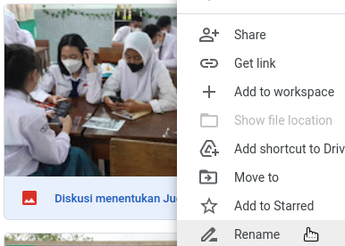
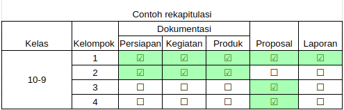

## List yang dikumpulkan 

Pada pelaporan projek, hal yang perlu dipersiapkan
* Wajib mengumpulkan dokumentasi per kelompok di [google drive](https://bit.ly/driveprojek81)
* Dokumentasi minimal 5 dengan nama file yang deskriptif, misal : `Kegiatan menentukan tempat pelaksanaan.jpg`

Struktur folder harus terisi seperti berikut
```
├── 10-1
│   ├── Dok_persiapan
│   │   ├──gambar1.jpg
│   │   ├──gambar2.jpg
│   │   ├── . . .
│   │   ├──gambar10.jpg
│   ├── Dok_pelaksanaan
│   ├── Dok_produk
│   ├── Proposal
│   │   ├──proposal.pdf
│   ├── dst . . .
├── 10-2
├── 10-3
├── dst . . 

```
Sehingga akan direkapitulasi dalam bentuk cheklist (update otomatisi ±15 min ) 

Link [rekapitulasi di sini](https://bit.ly/driveprojek81-rekap)
* Infografis laporan pelaksanaan
  - judul 
  - latar belakang singkat
  - proses (dokumentasi langkah-langkah, alur dsb)
  - foto produk atau hasil kegiatan
* Laporan berupa dokumen
  - format ada di [sini](https://bit.ly/formatlaporanprojek81)
  - laporan ditandatangi oleh guru pembimbing
* Power point (_optional_), persiapan presentasi pameran
* Pertanyaan hubungi [Pak Arif](https://wa.me/6282227551553), [Bu Fitria](https://wa.me/6282114214648), [Bu Byas](https://wa.me/628999787815)
