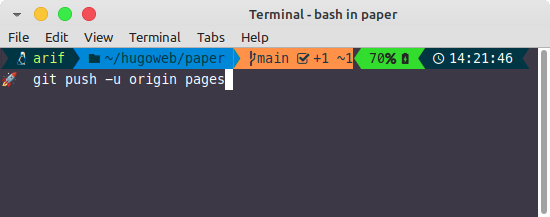

Membuat blog menggunakan [**HUGO**](https://gohugo.io) membutuhkan waktu lama dan menguras banyak tenaga di awal. Tentu saja karena bahasa [Go](https://go.dev/doc/tutorial/create-module) yang masih terbilang kurang familiar. Justru ini tantangan, pantang untuk mundur. Toh dari lahir manusia sudah didesain mampu menghadapi kesulitan.

> "_walaupun sulit, besok juga sulit, kenapa tidak bersenang senang dengan kesulitan sekarang_"

Kedepannya, blog ini semoga konsisten sebagai catatan dan dokumentasi kegiatan sehari-hari. 

Sebagai bukti bahwa blog ini sebagai dokumentasi, ingatlah perintah ini  
```
git add .
git commit -m "pesan"
git push -u origin pages
```

  :heart:


