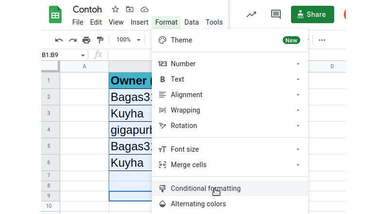
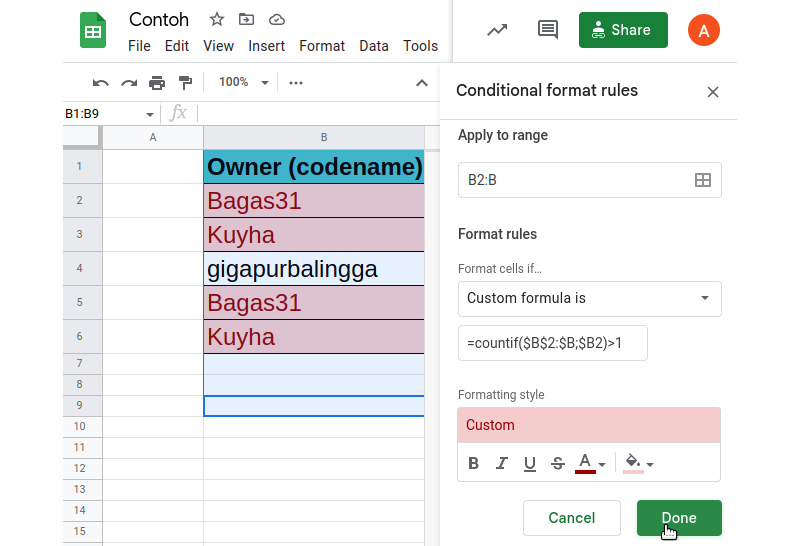

Penggunaan google spreadsheet semenjak pasca pandemi terus meningkat dan menjadi pengganti ms excel.  
Ada kalanya kebutuhan yang ada di ms excel tidak dapat dijawab secara langsung di google spreadsheet, perlu pengaturan khusus. Salah satu yang saya temukan adalah ketiadaan **highlight duplicate cell**. 

## Langkah 
Langkah pengerjaannya cukup mudah. Pertama pastikan cell mana yang akan dicek duplikasinya. Pada contoh ada di B2 hingga B8. Bisa sebutkan dari B2:B jika ke bawah semaksimalnya. 
1. Klik `format` pilh `conditional formating`

2. Isikan range, dan `format rules` dengan **custom formula is**

3. Isikan rumus berdasarkan baris yang akan dicek 
```
=countif($B$2:$B;$B2)>1
```

Viola! 


