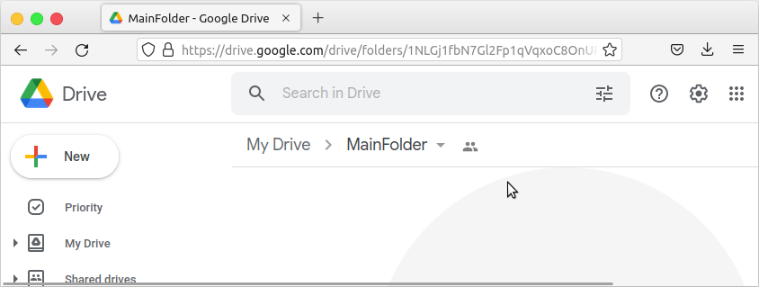
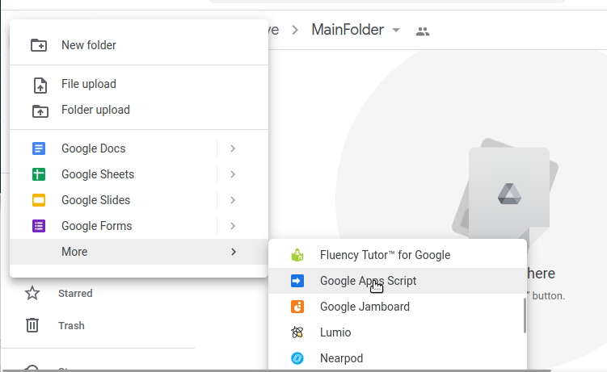
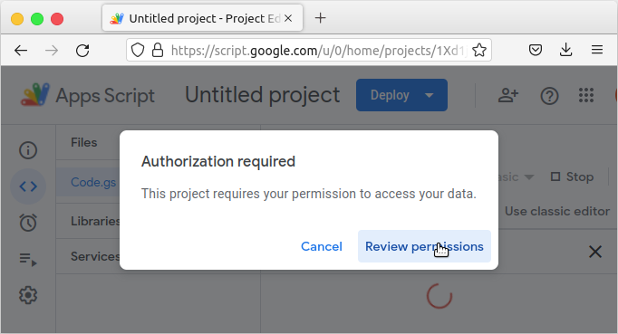
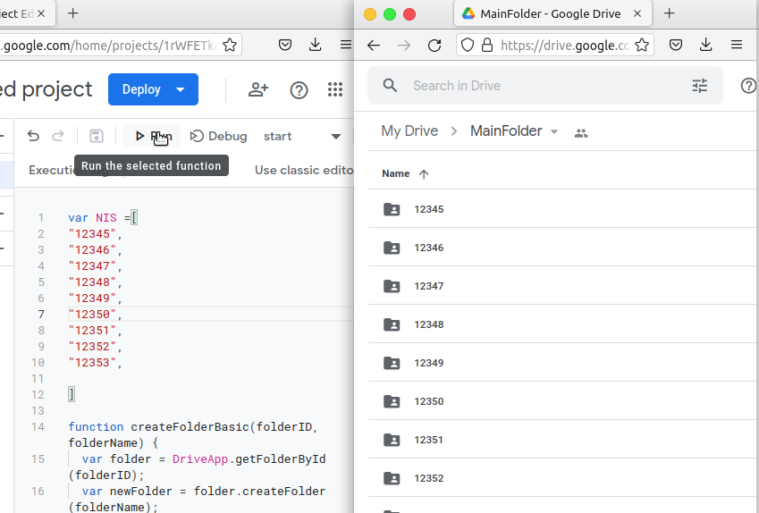

Pada postingan sebelumnya disebutkan bahwa jika ingin membuat validasi folder sudah terisi atau belum dapat menggunakan script [Membaca Folder Google Drive](https://arifsatuan.github.io/post/script_gdrive). Masalah muncul jika folder yang disediakan sangat banyak (sejumlah siswa atau karyawan kantor), maka membuat folder juga perlu dikerjakan menggunakan script. 



Pada alamat google drive, ada bagian yang menunjukkan **Folder Id** 
```
https://drive.google.com/drive/folders/1NLGj1fbN7Gl2Fp1qVqxoC8OnURxlFl1l
``` 
Perhatikan  `1NLGj1fbN7Gl2Fp1qVqxoC8OnURxlFl1l` adalah folder Id. Kemudian buat script baru dengan klik `New` di google drive -> `more` -> `Google Appscript`



Script yang diisikan berupa list atau array dengan nama `NIS`, bisa disesuaikan dengan kebutuhan. 

Copy Paste Script berikut.


```
var NIS =[
"12345",
"12346",
"12347",
"12348",
"12349",
"12350",
"12351",
"12352",
"12353",

]

function createFolderBasic(folderID, folderName) {
  var folder = DriveApp.getFolderById(folderID);
  var newFolder = folder.createFolder(folderName);
  return newFolder.getId();
};
 
function start(){
  //folder ID
  var FOLDER_ID = '1NLGj1fbN7Gl2Fp1qVqxoC8OnURxlFl1l';
 for (var i=0; i<=NIS.length-1;i++){
   console.log(NIS[i]);
  var myFolderID = createFolderBasic(FOLDER_ID, NIS[i]);
 }
 
 
};
```
NIS tidak terbatas, bisa hingga ratusan atau ribuan. Silakan dicoba saja. 

Proses selanjutnya adalah `save` ->`run`. Jika diminta `review permission` klik saja, lalu pilih `allow` 



Berikut hasil jika proses running sudah selesai 


Semoga membantu. 
