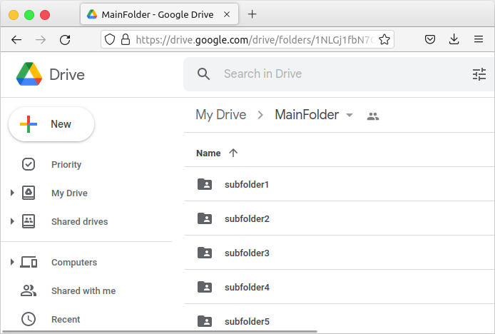
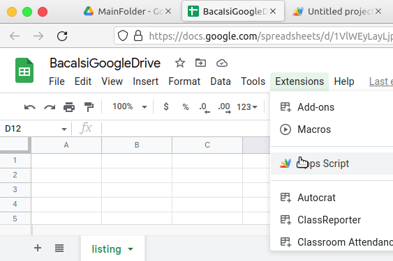
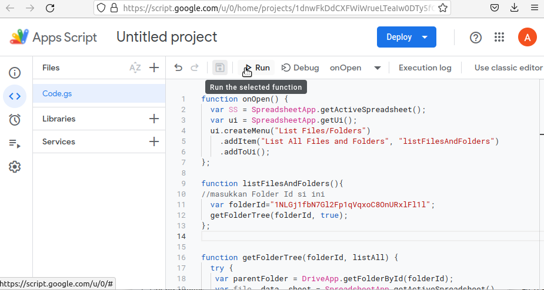
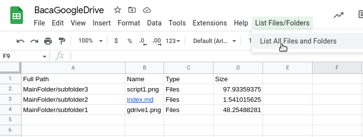
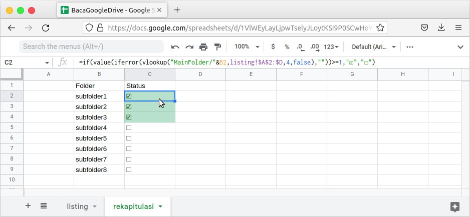

Catatan kali ini diinspirasi dari "kemalasan" untuk tiap folder di google drive. Ceritanya sedang membuat folder yang diisi bersama, namun perlu dikonfirmasi siapa saja yang sudah dan siapa saja yang belum. Jika hanya kurang dari 10 tentu tidak masalah, lain halnya jika banyak folder yang harus dicek. 

## Membuat Folder Gdrive
Langkah pertama tentu saja membuat folder utama gdrive dan catat ID folder. Misal kita buat folder dengan nama `MainFolder` dan berisi subfolder seperti berikut

Dimana nanti akhirnya kita ingin setiap subfolder diisi/diupload penanggungjawabnya seperti `subfolder3` dan `subfolder4`
```
├── MainFolder
│   ├── subfolder1
│   ├── subfolder2
│   ├── subfolder3
│   │   ├──file.pdf
│   ├── subfolder4
│   │   ├──file.pdf
│   ├── dst . . .
```
File tidak harus **.pdf** bisa berupa file apa saja. 

Pada alamat google drive, ada bagian yang menunjukkan **Folder Id** 
```
https://drive.google.com/drive/folders/1NLGj1fbN7Gl2Fp1qVqxoC8OnURxlFl1l
``` 
Perhatikan  `1NLGj1fbN7Gl2Fp1qVqxoC8OnURxlFl1l` adalah folder Id.
## Membuat Spreadsheet dan Macro
Langkah selanjutnya adalah membuat file spreadsheet dengan perintah `sheet.new` di address bar browser kesayangan. 


Buat script dengan klik menu `extensions-> AppScript` Lalu Paste
code berikut. 
```
function onOpen() {
  var SS = SpreadsheetApp.getActiveSpreadsheet();
  var ui = SpreadsheetApp.getUi();
  ui.createMenu("List Files/Folders")
    .addItem("List All Files and Folders", "listFilesAndFolders")
    .addToUi();
};

function listFilesAndFolders(){
//masukkan Folder Id si ini
  var folderId="1NLGj1fbN7Gl2Fp1qVqxoC8OnURxlFl1l";
  getFolderTree(folderId, true); 
};


function getFolderTree(folderId, listAll) {
  try {
   var parentFolder = DriveApp.getFolderById(folderId);
   var file, data, sheet = SpreadsheetApp.getActiveSpreadsheet().  getSheetByName("listing");
// "listing" adalah nama sheet yang akan menyimpan
    sheet.clear();
    sheet.appendRow(["Full Path", "Name","Type" ,"Size"]);
   getChildFolders(parentFolder.getName(), parentFolder, data, sheet, listAll);
  } catch (e) {
    Logger.log(e.toString());
  }
};

function getChildFolders(parentName, parent, data, sheet, listAll) {
  var childFolders = parent.getFolders();
 
  while (childFolders.hasNext()) {
    var childFolder = childFolders.next();
    
    // List files inside the folder
    var files = childFolder.getFiles();
   while (listAll & files.hasNext()) {
      var childFile = files.next();
      data = [ 
        parentName + "/" + childFolder.getName() ,
        childFile.getName(),
        "Files",
        childFile.getSize()/1024,
       ];
     
      sheet.appendRow(data);
    } 
        getChildFolders(parentName + "/" + childFolder.getName(), childFolder, data, sheet, listAll);  
  }
};
```
Simpan dan klik run , kemudian jika ada pop up pilih `review` dan `allow`


Kembali ke google spreadsheet, dengan sheet yang diberi nama `listing` dan run menu baru di atas



Maka akan muncul nama file yang sudah dimasukkan ke subfolder 1,2,3 (sebagai contoh), sedangkan subfolder4 dan subfolder5 belum diisi. 

## Gunakan Vlookup 

Bagian selanjutnya adalah memanfaatkan `vlookup`, `concatenate` dengan variabel size. Jika size lebih dari 0 maka dianggap sudah terupload filenya. 
```
=if(value(iferror(vlookup("MainFolder/"&B2,listing!$A$2:$D,4,false),""))>=1,"☑","☐")
```


> Tips! Jika ingin membuat folder untuk satu kantor, sekolah, gunakan nama yang bagus seperti NIS, Nomor Karyawan, dsb. 

Jika berminat untuk _copy_ file spreadsheet bisa buka [link berikut](https://docs.google.com/spreadsheets/d/1VlWEyLayLjpwTselyJLoytKSI9P0SCwHoYGCLHmR1Wk/copy)
