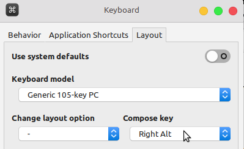
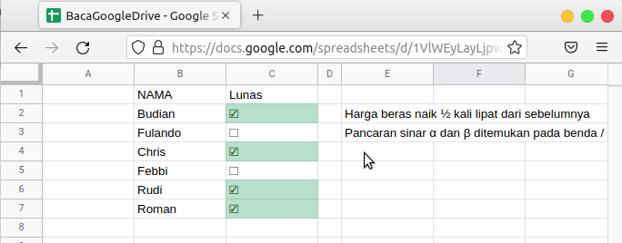

Bagi sebagian orang menuliskan symbol tertentu tidak terlalu penting, namun bagi sebagian orang  hal tersebut menjadi vital. Misal saja seorang guru ingin menuliskan `3akar2` akan lebih baik jika ditulis `3√2`. Begitu juga simbol theta, setengah, alfa, pangkat dua dsb `θ, ½, α, x²`

## Install 
Menuliskan simbol-simbol umum cukup menggunakan _tool_ yang disebut Compose. Di windows kita gunakan `WinCompose` sedangkan di linux ada `XCompose`

Pada **windows** hanya cukup install `WinCompose` di [sini](http://wincompose.info)

Bagi pengguna **linux** langkahnya cukup berbeda. 
1. Buka link berikut [https://github.com/kragen/xcompose](https://github.com/kragen/xcompose)
2. Clone dengan perintah 
```git
git clone https://github.com/kragen/xcompose.git
```
3. Buka foldernya dengan
```bash
cd xcompose
./install
```
4. Enable keyboard compose key
`setting > keyboard > tab layout > Compose key = Right Alt`


## Pengaplikasian

Pengaplikasian cukup mudah. Baik di **windows** maupun **linux** kombinasinya sebagian besar sama. Bagi yang belum hafal bisa cek kombinasi di [sini](https://raw.githubusercontent.com/kragen/xcompose/master/dotXCompose). Misal mau menampilkah karakter theta. Tertulis bahwa `<multi_key> <asterisk> <u>`. Maka saat secara berurutan mengetik
`Alt -> * -> u` maka akan muncul huruf `θ`

Admin yang ingin melakukan rekapitulasi dengan tanda cheklist juga tidak perlu repot hanya dengan 

`Alt` `[` `spasi` `]` bisa menghasilkan `☐`

`Alt` `[` `v` `]` bisa menghasilkan `☑`



Jika ada yang ingin diubah silakan ganti dengan editor favorit kalian di 
```bash
nano ~/.XCompose
```

Sekian postingan ini ditulis saat suhu ruangan 28°C 
:grin: selamat mencoba
