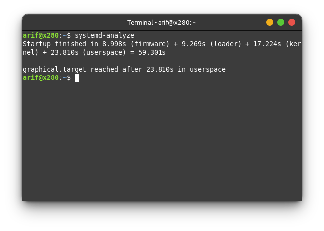
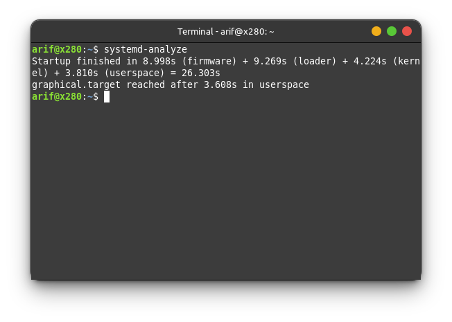

# Faster Boot Linux


### 1. Check speed of loading
Just type on your favourite terminal to get know your 
```bash
systemd-analyze
```


As you can see above, full time to booting is `59,301s` with specific below

|no | Term | time (s) | description |
----|------|----------|------------ |
|1. |**Firmware** |  `8,998s`| speed when booting (BIOS) |
|2. |**Loader** |  `9,269s`| loader I don't know |
|3. |**Kernel** |  `17,224s`| time when loading initramfs that compressed  |
|4. |**Userspace** |  `23,810s`| time starting app|

### 2. Know which suspect
Know which the suspect to be _blaming to_ we can type on terminal like below:
```bash
systemd-analyze blame
```
Resulting
```bash
6.681s NetworkManager-wait-online.service
5.051s bolt.service
2.954s systemd-udev-settle.service
1.917s blueman-mechanism.service
1.680s mariadb.service
1.238s networkd-dispatcher.service
 950ms udisks2.service
 948ms apache2.service
 885ms accounts-daemon.service
 749ms ModemManager.service
 683ms dev-sda6.device
 446ms cups.service
 423ms user@1000.service
 407ms ubuntu-system-adjustments.service
 402ms gdm.service
 378ms power-profiles-daemon.service
 370ms polkit.service
 364ms avahi-daemon.service
 363ms bluetooth.service
```
Look above, `NetworkManager-wait-online.service` took 6,6s then `bolt.service` took 5s. It may vary depend on your system. 

### 3. Reduce it!
To reduce this to boot on initial, can just **mask** using `systemctl`
```bash
sudo systemctl mask NetworkManager-wait-online.service
sudo systemctl mask bolt.service
etc . . .
```
### 4. Change compression
By changing the compression algorithm, we can save some time as some algorithms are faster to decompress the data. I’ve found that lz4 is the fastest for my case. It may vary for your CPU. The image is 6.6MB now, but it decompresses a lot faster.
```bash
$ sudo vi /etc/initramfs-tools/initramfs.conf

MODULES=dep
COMPRESS=lz4

$ sudo update-initramfs -u
```
### 5. Check Result
After two treatments above, we can repeat `systemd-analyze` again. 


Horay!!! That is great improvement. From total `59 s` to `26 s`


