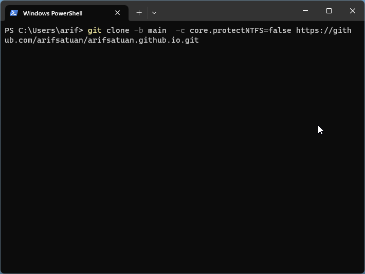

# Git:Clone Succeeded, but checkout failed


Git is very handy tools for programmers. But, unfortunatelly there are some mistakes or issues when using it. Personally, I can't recall problems that I have facing. 

Today I have problem that I can clone but checkout failed, just shown at picture below


Solution for that is very easy. 
Add command like below 
```
git clone -b main -c core.protectNTFS=false  LINK OF GITHUB
```

Shown like below:


