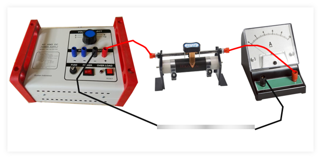
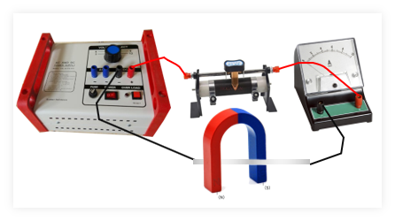
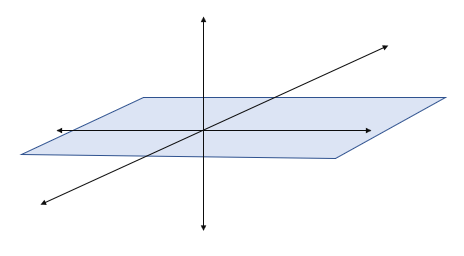
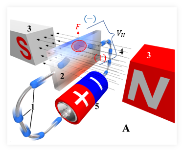
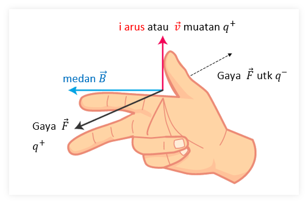
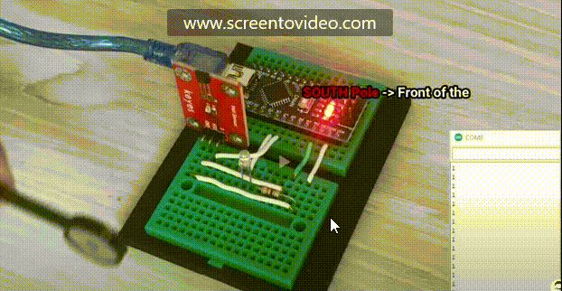

# Fisika Bacaan 1

### 1. Praktikum 
**Praktikum Gaya Lorentz**

1. magnet U atau dua buah magnet Batang
2. Siapkan alumunium foil sebagai penghantar (setipis mungkin)
3. Catu daya 
4. Resistor (rheostat)
5. Amperemeter 
 


1. Susun peralatan seperti berikut

2. Pastikan arus terukur pada angka mendekati `3A`
3. Matikan catu daya
4. Posisikan magnet seperti demikian

5. Nyalakan catu daya dan perhatikan gerakannya
 


1. Perhatikan arah medan, arah arus gerakannya
2. Gambarkan menggunakan grafik berikut
 
3. Catat rangkaian di atas **di buku catatan**, serta hasil pada poin nomor 2 
4. Perhatikan bacaan di bawah mengenai aturan tangan kanan, apakah sudah sesuai?
5. Secara berkelompok (5 orang) silakan buat projek penggunaan sensor magnetik (Hall effect) 
6. Prinsip pembuatan alat : "Berfungsi & ekonomis"

### 2. Simak bacaan
**Sensor Hall dan Aplikasinya**

Efek tegangan Hall awalnya ditemukan oleh Edwin Hall pada tahun 1879. Efek hall disebabkan sifat arus yang melalui suatu konduktor. Teori ini akhirnya digunakan pada berbagai bidang, misalnya sensor arus, sensor tekanan, sensor dan sensor aliran fluida, dsb. Penemuan ini lah yang sering dikenal sebagai sensor medan magnet atau sensor efek Hall, atau dikenal _Hall Effect sensor_. 

Efek Hall adalah munculnya perbedaan tegangan pada penghantar yang tegak lurus antara arus dan medan magnet. Pemahaman mengenai efek Hall dapat dilihat pda ilustrasi berikut

Elektron mengalir dari negatif ke positif. Artinya ada arus dari positif ke negatif. Agar lebih mudah dan konsisten dengan ilustrasi, tidak perlu memperhatikan arah arus. Cukup lihat gerakan muatan negatif (elektron). Medan magnet $ B $ dari kutub utara menuju kutub selatan. Dengan menggunakan aturan tangan kanan untuk muatan negatif maka timbul gaya ke arah atas. Sehingga elektron terdorong ke atas. Akibatnya bagian atas lebih **negatif** daripada bagian bawah. Dengan kata lain, bagian bawah bersifat **positif** bagian atas bersifat **negatif**. Inilah yang menyebabkan timbul tegangan-Hall (perhatikan gambar)

Pada umumnya efek-Hall dan tegangan-Hall dijadikan dasar dalam pembuatan sensormagentik. Tegangan-Hall $ V_H $ bernilai proporsional atau sebanding dengan kekuatan medan magnet yang menembus penghantar tersebut. Besarnya tegangan-Hall bisa saja sangat kecil, dalam orde microvolts, bahkan saat magnet yang sangat kuat didekatkan. Oleh karena itu perangkat yang menggunakan sifat efek-Hall disertai penguat DC (amplifier), histerisis, dan pengatur tegangan untuk memperbaiki sensitivitas dan output dari perangkat tersebut.

Aplikasi efek-Hall sebagai sensor antara lain
- sebagai _switch_ atau saklar
- pendeteksi tekanan (tombol pada keyboard)
- pengukur kecepatan pada putaran (mesin atau roda)
- deteksi layar laptop / handphone terbuka atau tertutup
- pengukuran arus tanpa sentuh (contactless)
- dan sebagainya

Sensor Hall tersedia dalam berbagai bentuk, dari IC (SMD) maupun komponen DIP. Harganya juga bervariasi dari yang paling murah hingga paling mahal. Secara umum sensor hall yang ada di pasaran Indonesia seperti pada gambar.

### 3. Pertanyaan


<link rel="stylesheet" href="/css/form.css">

<iframe name="hidden_iframe" id="hidden_iframe" style="display:none;" 
onload="if(submitted) {window.location='/thankyou';}"></iframe>

<form action="https://docs.google.com/forms/d/e/1FAIpQLSc4_IDUPGYGTHQ0g0GgBTc3sGdQSbMA-Sbr02SijiO-qT_EAg/formResponse" 
method="post" target="hidden_iframe" onsubmit="submitted=true;">
</form>
<form action="https://docs.google.com/forms/d/e/1FAIpQLSc4_IDUPGYGTHQ0g0GgBTc3sGdQSbMA-Sbr02SijiO-qT_EAg/formResponse" method="post" target="hidden_iframe" onsubmit="submitted=true">
  <label>NIS</label>
        <input type="text" pattern="^[0-9]{5}$" placeholder="5 digit NIS" class="form-input" name="entry.472610624" required title="Harus 5 digit atuh Neng!">

   <label>Resume</label>
        <textarea rows="8" placeholder="ketikkan minimal 2 paragraf kegiatan praktikum hari ini dihubungkan dengan teks bacaan di atas &#10; &#10; Paragraf 1 kesimpulan praktikum &#10; &#10; Paragraf 2 komentar mengenai teknologi terbaru" class="form-input" name="entry.1370131877" ></textarea>

   <button type="submit">Send</button>
</form>


