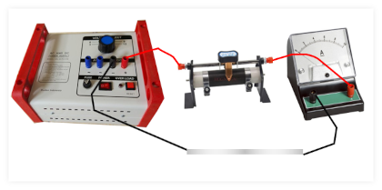

# Fisika Bacaan 1

### 1. Praktikum 
**Praktikum Gaya Lorentz**

1. magnet U atau dua buah magnet Batang
2. Siapkan alumunium foil sebagai penghantar (setipis mungkin)
3. Catu daya 
4. Resistor (rheostat)
5. Amperemeter 
 


1. Susun peralatan seperti berikut

2. Pastikan arus terukur pada angka mendekati `3A`
3. Matikan catu daya
4. Posisikan magnet seperti demikian

5. Nyalakan catu daya dan perhatikan gerakannya
 

### 2. Simak bacaan
**Sensor Hall dan Aplikasinya**

Efek tegangan Hall awalnya ditemukan oleh Edwin Hall pada tahun 1879. Efek hall disebabkan sifat arus yang melalui suatu konduktor. Teori ini akhirnya digunakan pada berbagai bidang, misalnya sensor arus, sensor tekanan, sensor dan sensor aliran fluida, dsb. Salah satu penemuan yang dapat mengukur medan magnet adalah sensor efek Hall, atau dikenal _Hall Effect sensor_. 

Efek Hall adalah munculnya perbedaan tegangan pada penghantar yang tegak lurus antara arus dan medan magnet. Pemahaman mengenai efek Hall dapat dilihat pda ilustrasi berikut

Elektron mengalir dari negatif ke positif. Artinya ada arus dari positif ke negatif. Medan magnet $ B $ dari kutub utara menuju kutub selatan. Dengan menggunakan aturan tangan kanan untuk muatan negatif maka timbul gaya ke arah atas. Sehingga elektron terdorong ke atas. Akibatnya bagian atas lebih **negatif** daripada bagian bawah. Dengan kata lain, bagian bawah bersifat **positif** bagian atas bersifat **negatif**. Inilah yang menyebabkan timbul tegangan-Hall. 

### 2. Jawab Pertanyaan

