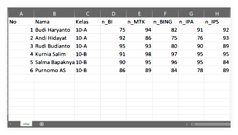
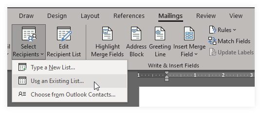
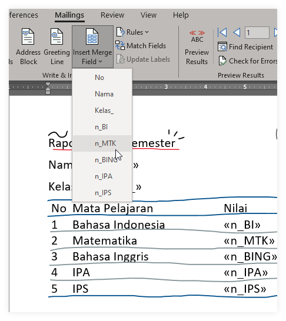
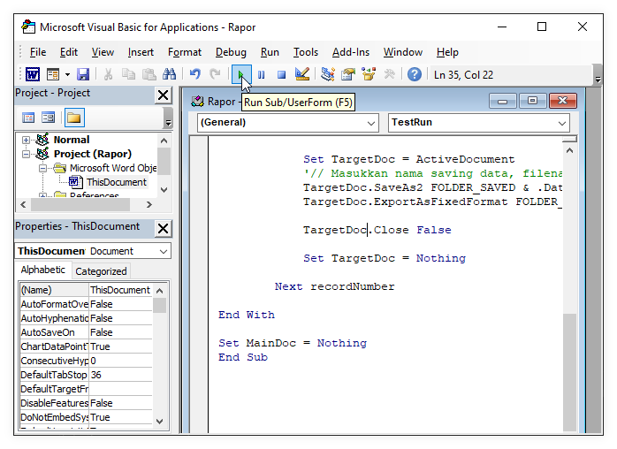
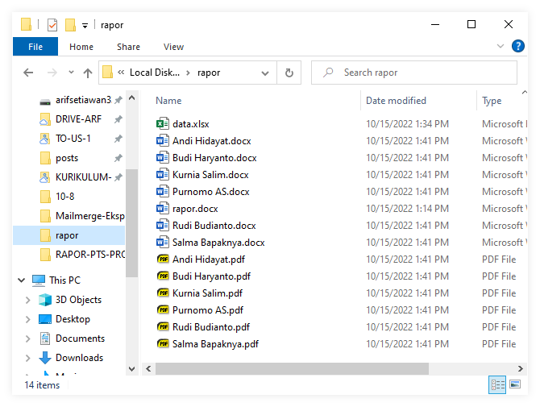

# Mailmerge Eksport Ke PDF

### 1. Membuat Dokumen Template 
Langkah pertama adalah membuat dokumen template dengan membuat dua buah dokumen yakni word dan excel 
1. rapor.docm (documen dengan makro)
2. data.xlsx 


### 2. Siapkan data 
Langkah selanjutnya adalah menyiapkan data sesuai dengan kolom pada tabel yang akan diisi. Bisa juga sebaliknya, sesuaikan template dengan kolom data yang akan ditampilkan. 

Simpan data dalam folder yang sama agar memudahkan mencarinya.

Penamaan File jangan ada spasi, gantikan dengan under score atau strip
```
rapor-ganjil.docm
rapor_ganjil.docm
```


### 3. Menambahkan mail merge
Tambahkan list data dengan menggunakan menu mailing list
```
Klik Mailings -> Select Recipients -> Use An Existing List 
```


Insert Merge Field sesuai isi 


Preview Result untuk memastikan bahwa tidak ada yang tertukar

### 4. Menambahkan script 
Melakukan save as pdf atau print as pdf secara manual satu per satu akan membutuhkan banyak waktu dan tenaga, oleh karena itu kita gunakan bantuan script dengan menggunakan tombol `Atl F11`, lalu copy berikut
```basic
Option Explicit
'//Lookasi file akan disave dan lokasi excel
Const FOLDER_SAVED As String = "C:\rapor\"
Const SOURCE_FILE_PATH As String = "C:\rapor\data.xlsx"

Sub TestRun()
Dim MainDoc As Document, TargetDoc As Document
Dim dbPath As String
Dim recordNumber As Long, totalRecord As Long

Set MainDoc = ActiveDocument
With MainDoc.MailMerge
    
        '// if you want to specify your data, insert a WHERE claus   Lokasi SHEET
        .OpenDataSource Name:=SOURCE_FILE_PATH, sqlstatement:="SELECT * FROM [nilai$]"
            
        totalRecord = .DataSource.RecordCount

        For recordNumber = 1 To totalRecord
        
            With .DataSource
                .ActiveRecord = recordNumber
                .FirstRecord = recordNumber
                .LastRecord = recordNumber
            End With
            
            .Destination = wdSendToNewDocument
            .Execute False
            
            Set TargetDoc = ActiveDocument
            '// Masukkan nama saving data, filename nantinya 
            TargetDoc.SaveAs2 FOLDER_SAVED & .DataSource.DataFields("Nama").Value & ".docx", wdFormatDocumentDefault
            TargetDoc.ExportAsFixedFormat FOLDER_SAVED & .DataSource.DataFields("Nama").Value & ".pdf", exportformat:=wdExportFormatPDF
            
            TargetDoc.Close False
            
            Set TargetDoc = Nothing
                    
        Next recordNumber

End With

Set MainDoc = Nothing
End Sub
```
Lalu run hingga selesai proses save to pdf



<kbd>Alt</kbd> + <kbd>F11</kbd> adalah `shortcut` membuka visual basic application.


