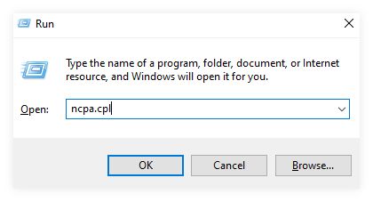

# Shortcut Favorit Windows

Shortcut sesuai dengan namanya membuat hidup kita lebih mudah. Berikut shortcut yang dikompilasi sering digunakan pada umumnya
### 1. Kelompok Ctrl 
<table>
    <thead>
        <tr>
            <td style="width:4%">No</td>
            <td style="width:40%">Shortcut</td>
            <td>Fungsi</td>
        </tr>
    </thead>
    <tbody>
        <tr>
            <td>1</td>
            <td><kbd>Ctrl</kbd> + <kbd> C </kbd></td>
            <td>Copy teks yang sedang dipilih (selected)</td>
        </tr>
        <tr>
            <td>2</td>
            <td><kbd>Ctrl</kbd> + <kbd> A </kbd></td>
            <td>Memilih semua teks yang sedang tampil</td>
        </tr>
        <tr>
            <td>3</td>
            <td><kbd>Ctrl</kbd> + <kbd> V </kbd></td>
            <td>Paste / menempelkan teks yang sudah dicopy sebelumnya</td>
        </tr>
        <tr>
            <td>4</td>
            <td><kbd>Ctrl</kbd> + <kbd> X </kbd></td>
            <td>Cut atau memotong teks untuk selanjutnya dipaste</td>
        </tr>
    </tbody>
</table>

### 2. Kombinasi tombol Windows
<table><thead><tr><td style="width:5%">No</td><td style="width:40%">Shortcut</td><td>Fungsi</td></tr></thead><tbody><tr><td>1</td><td><kbd>:(fa-brands fa-windows):</kbd> + <kbd> E </kbd></td><td>Membuka Windows Explorer (File)</td></tr><tr><td>2</td><td><kbd>:(fa-brands fa-windows):</kbd> + <kbd> D </kbd></td><td>Menampilkan desktop sekaligus minimize</td></tr><tr><td>3</td><td><kbd>:(fa-brands fa-windows):</kbd> + <kbd> R </kbd></td><td>Menjalankan (run) program tertentu, lebih lengkapnya di bawah</td></tr><tr><td>4</td><td><kbd>:(fa-brands fa-windows):</kbd> + <kbd> I </kbd></td><td>Membuka fitur Setting pada windows</td></tr><tr><td>5</td><td><kbd>:(fa-brands fa-windows):</kbd> + <kbd> → </kbd></td><td>Menggeser window (aplikasi) menjadi setengah di kanan</td></tr><tr><td>6</td><td><kbd>:(fa-brands fa-windows):</kbd> + <kbd> ← </kbd></td><td>Menggeser window (aplikasi) menjadi setengah di kiri</td></tr><tr><td>7</td><td><kbd>:(fa-brands fa-windows):</kbd> + <kbd> ↑ </kbd></td><td>Menggeser window (aplikasi) menjadi setengah di atas</td></tr></tbody></table>

### 3. Shortcut di Microsoft Office
<table><thead><tr><td style="width:5%">No</td><td style="width:40%">Shortcut</td><td>Fungsi</td></tr></thead><tbody><tr><td>1</td><td><kbd>Ctrl</kbd> + <kbd> C </kbd></td><td>Copy teks yang sedang dipilih (selected)</td></tr><tr><td>2</td><td><kbd>Ctrl</kbd> + <kbd> A </kbd></td><td>Memilih semua teks yang sedang tampil</td></tr><tr><td>3</td><td><kbd>Ctrl</kbd> + <kbd> V </kbd></td><td>Paste / menempelkan teks yang sudah dicopy sebelumnya</td></tr><tr><td>4</td><td><kbd>Ctrl</kbd> + <kbd> X </kbd></td><td>Cut atau memotong teks untuk selanjutnya dipaste</td></tr><tr><td>5</td><td><kbd>Ctrl</kbd> + <kbd> E </kbd></td><td>Mengatur teks agar berada di tengah</td></tr><tr><td>6</td><td><kbd>Ctrl</kbd> + <kbd> J </kbd></td><td>Mengatur agar teks rata kanan kiri (justify)</td></tr><tr><td>7</td><td><kbd>Ctrl</kbd> + <kbd> L </kbd></td><td>Mengatur agar teks rata di kiri (left) atau <kbd> R</kbd> untuk kanan</td></tr><tr><td>8</td><td><kbd>Ctrl</kbd> + <kbd> B </kbd></td><td>Mengatur agar teks <strong>tebal</strong></td></tr><tr><td>9</td><td><kbd>Ctrl</kbd> + <kbd> I </kbd></td><td>Mengatur agar teks <em>italic atau miring</em></td></tr><tr><td>10</td><td><kbd>Ctrl</kbd> + <kbd> U </kbd></td><td>Mengatur agar teks <u>bergaris bawah</u> atau <u>underlined</u></td></tr><tr><td>11</td><td><kbd>Ctrl</kbd> + <kbd> S </kbd></td><td>Menyimpan dokumen, TIPS : sering lakukan agar aman</td></tr><tr><td>12</td><td><kbd>F12</kbd></td><td>Save as atau simpan sebagai</td></tr><tr><td>13</td><td><kbd>F4</kbd></td><td>Mengulang format atau perintah terakhir</td></tr><tr><td>14</td><td><kbd>Ctrl</kbd> + <kbd> Z </kbd></td><td>Kembali ke tahap sebelumnya, UNDO</td></tr><tr><td>15</td><td><kbd>Ctrl</kbd> + <kbd> P </kbd></td><td>Mencetak atau Print dokumen</td></tr></tbody></table>

### 4. Windows + R 
Cara penggunaannya, klik bersamaan <kbd>:(fa-brands fa-windows):</kbd>+<kbd>R</kbd> lalu masukkan keyword berikut, lalu tekan <kbd>↵</kbd>

| No | Shortcut       | Fungsi                                                 |
|----|----------------|--------------------------------------------------------|
| 1  | `appwiz.cpl`   | Uninstall program                                      |
| 2  | `ncpa.cpl`     | Network Connection (untuk konfigurasi network devices) |
| 3  | `%tmp%`        | Membuka folder temporary                               |
| 4  | `services.msc` | Menampilkan service sedang berjalan                    |
| 5  | `resmon`       | Menampilkan _resources_ seperti CPU, RAM, HDD, Network |
| 6  | `powercfg.cpl` | Menampilkan power configurasi                          |
| 7  | `regedit`      | Membuka registry Editor                                |
| 8  | `cmd`          | Membuka aplikasi command Promt                         |
| 9  | `powershell`   | Membuka terminal powershell (generasi baru cmd)`       |
| 10 | `winver`       | Menampilkan versi windows :(fa-brands fa-windows):     |
| 11 | `control`      | Menampilkan control panel                              |
| 12 | `.`            | Menampilan folder user utama                           |
| 13 | `mrt`          | Malicious Software Removal Tool                        |
| 14 | `osk`          | OnScreen Keyboard                                      |
| 15 | `wfs`          | Windows Fax and Scanner                                |

